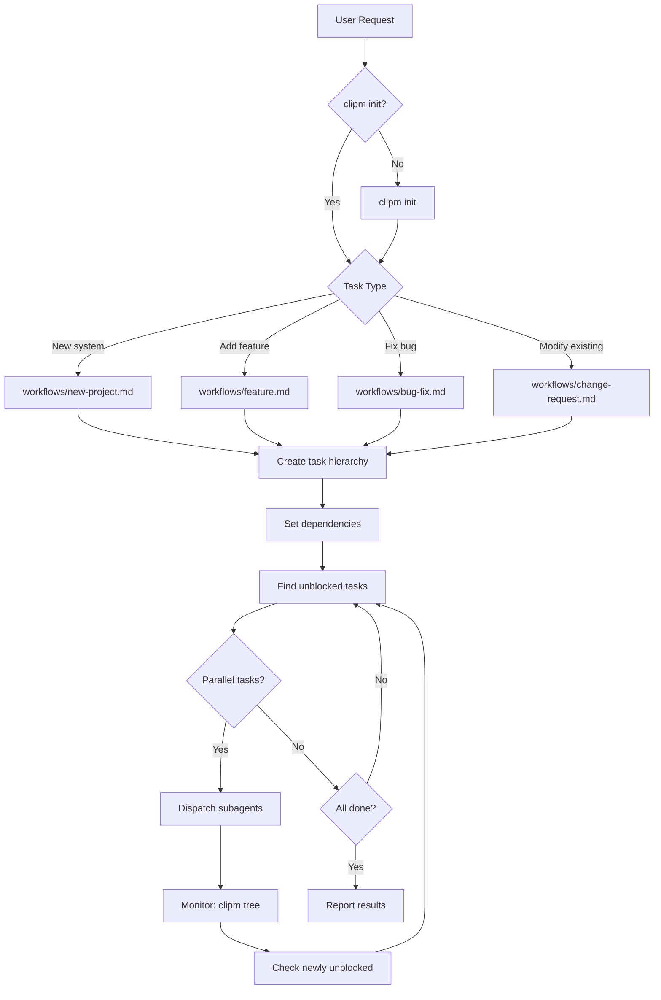

# Project Manager Skill

Decompose work into hierarchical tasks (clipm) and dispatch parallel subagents.

## ⚠️ CRITICAL REQUIREMENTS

- **Block order**: `clipm block <blocker> <blocked>` — first arg blocks the second
- **Parallel dispatch**: Use multiple Task tool calls in a SINGLE message
- **Concurrency limit**: Max 3-5 subagents at once
- **File conflicts**: NEVER parallelize tasks modifying the same files
- **Verify before dispatch**: Check `blockedBy` is empty before assigning
- **IDs are strings**: clipm IDs are 4-char strings (e.g., `unke`), not integers

## Workflow Overview



## Phase 0: Research (Before Task Creation)

When the project involves external tools, APIs, or libraries:

1. **Identify unknowns** - List external dependencies that need verification
2. **Verify APIs** - Check actual command syntax, available endpoints, field names
3. **Document findings** - Note exact commands/APIs to use in task descriptions

Do NOT proceed to task creation until external dependencies are verified.

See [workflows/new-project.md](workflows/new-project.md#external-tool-discovery) for discovery patterns.

## Quick Reference

### Initialize
```bash
[ ! -d ".clipm" ] && clipm init
```

### Create Hierarchy
```bash
clipm add "Root task"              # Returns {"id": "abcd", ...}
clipm add "Child" --parent abcd    # Child of task abcd
clipm block abcd efgh              # efgh waits for abcd
```

### Find Parallel Work
```bash
clipm list --status todo --unblocked
```

### Monitor
```bash
clipm tree                         # Visual hierarchy
clipm show <id>                    # Task details
```

## Subagent Dispatch

Dispatch using Task tool. **All independent tasks in ONE message.**

```
Execute clipm task <ID>: "<description>"

1. clipm claim <ID> <agent-name>
2. clipm status <ID> in-progress
3. <do the work>
4. clipm note <ID> "Done: <summary>"
5. clipm status <ID> done
```

See [orchestration/parallel.md](orchestration/parallel.md) for checklist and examples.

## When Things Go Wrong

See [troubleshooting/INDEX.md](troubleshooting/INDEX.md) for:
- Command failures
- Subagent failures
- Stuck tasks
- File conflicts

## Resuming Work

See [orchestration/recovery.md](orchestration/recovery.md) for mid-project re-entry.

## References

- [Workflow Index](workflows/INDEX.md)
- [Orchestration Patterns](orchestration/INDEX.md)
- [clipm Commands](reference/clipm-commands.md)
