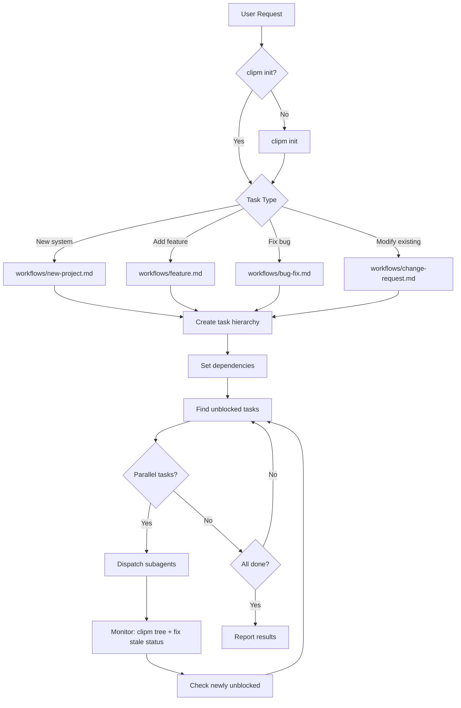

# Project Manager Skill

Decompose work into hierarchical tasks (clipm) and dispatch parallel subagents.

## ⚠️ CRITICAL REQUIREMENTS

- **Structured task fields**: Every `clipm add` MUST include `--action`, `--verify`, and `--result` flags. Every `clipm status <id> done` MUST include `--outcome "..."`. These are enforced by the CLI and will error if omitted.
- **Block order**: `clipm block <blocker> <blocked>` — first arg blocks the second
- **Parallel dispatch**: Use multiple Task tool calls in a SINGLE message
- **Concurrency limit**: Max 3-5 subagents at once
- **File conflicts**: NEVER parallelize tasks modifying the same files. Before dispatch, enumerate every file each agent will touch and check for overlaps. Test files are the most common offender — see [orchestration/parallel.md](orchestration/parallel.md#shared-file-partitioning)
- **Verify before dispatch**: Check `blockedBy` is empty before assigning
- **IDs are strings**: clipm IDs are 4-char strings (e.g., `unke`), not integers
- **Subagent prompts MUST include verification steps**: Every code-writing subagent must build AND runtime-test its output. "It imports" / "it compiles" is not done — reach at least Level 3 (static analysis) on the verification depth ladder. For non-runnable code (TUI, GUI, interactive), explicitly verify library attributes exist and unit-test pure logic helpers. See [orchestration/parallel.md](orchestration/parallel.md#-critical-always-include-verification-steps)
- **Subagent prompts MUST include edge cases**: The orchestrator has full context; subagents don't. Spell out edge cases (spaces in strings, empty inputs, quoting rules) explicitly in the prompt. See [orchestration/parallel.md](orchestration/parallel.md#-critical-include-edge-case-analysis-in-subagent-prompts)
- **Subagent prompts that rewrite existing code MUST list preserved behaviors**: When replacing a function/block, enumerate what the old code did (timing, logging, error format, return data shape). Subagents can't infer what they're replacing. See [orchestration/parallel.md](orchestration/parallel.md#-critical-preserve-existing-behavior-when-rewriting-code)
- **Integration checkpoint is MANDATORY**: After each wave completes (including inline tasks), the orchestrator must build and smoke-test before dispatching the next wave

## Workflow Overview



## Plan Mode Interop

If you already created a plan file (via plan mode) before invoking this skill, **use the plan as your task source** — don't re-research. Convert the plan's steps directly into clipm tasks with dependencies. The plan file is your Phase 0 output; skip to task creation.

## Phase 0: Research (Before Task Creation)

When the project involves external tools, APIs, or libraries:

1. **Identify unknowns** - List external dependencies that need verification
2. **Verify APIs** - Check actual command syntax, available endpoints, field names
3. **Document findings** - Note exact commands/APIs to use in task descriptions

Do NOT proceed to task creation until external dependencies are verified.

See [workflows/new-project.md](workflows/new-project.md#external-tool-discovery) for discovery patterns.

## Quick Reference

### Initialize
```bash
[ ! -d ".clipm" ] && clipm init
```

### Create Hierarchy
```bash
# Every clipm add requires --action, --verify, --result
clipm add "Root task" \
  --action "Complete all child tasks" \
  --verify "All children are done" \
  --result "Summary of outcomes"           # → abcd

clipm add "Child" --parent abcd \
  --action "Do the specific work" \
  --verify "Run tests and confirm" \
  --result "Report what changed"           # → efgh

clipm parent efgh abcd             # Set abcd as parent of efgh (positional, no flags)
clipm block abcd efgh              # efgh waits for abcd
```

### Find Parallel Work
```bash
clipm list --status todo --unblocked
```

### Monitor
```bash
clipm tree                         # Visual hierarchy
clipm show <id>                    # Task details
```

## Inline Execution (Small Tasks)

Not every task needs a subagent. The orchestrator SHOULD execute a task directly when ALL of:
- The task touches 1-2 files
- The change is under ~20 lines
- You already have the file content in context
- There's no benefit to parallelizing it with other work

Claim the task (`clipm claim <ID> orchestrator`), do the work, mark done with `clipm status <ID> done --outcome "..."`. This avoids the overhead of spawning an agent for trivial edits.

⚠️ **Inline tasks require the same verification rigor as subagent tasks.** "It imports" is not done. If you wrote code, runtime-test it — especially code that other tasks depend on. A bug in a shared dependency breaks every downstream consumer.

## Subagent Dispatch

Dispatch using Task tool. **All independent tasks in ONE message.**

```
Execute clipm task <ID>: "<description>"

## Setup
clipm claim <ID> <agent-name>
clipm status <ID> in-progress

## Task
<do the work — include edge cases explicitly>

## Verification
Choose verification strategy by code type:
- Runnable (CLI, API, script): build + run end-to-end with sample input
- Interactive (TUI, GUI, game, curses): verify imports + signatures,
  then extract and unit-test pure logic helpers (collision, scoring, AI, etc.)
- Library: import and call key functions with sample data + assert results

## Finish
clipm note <ID> "Done: <summary>"
clipm status <ID> done --outcome "<what was done and verified>"
```

See [orchestration/parallel.md](orchestration/parallel.md) for checklist and examples.

### After Subagent Completion

Run `clipm tree` after each dispatch wave returns.

**Fix stale leaf tasks:** If a completed subagent's task still shows `[TODO]`, manually run `clipm status <id> done --outcome "<verified: summary of work>"`. Subagents occasionally fail to update clipm.

**Roll up parent tasks:** After all children of a parent task are `[DONE]`, mark the parent done too: `clipm status <parent-id> done --outcome "All child tasks completed"`. This unblocks any tasks that depend on the parent (e.g., INDEX.md blocked by a "Write developer docs" parent).

**Avoid unnecessary grouping tasks.** Only create parent grouping tasks (e.g., "Write developer docs") when other tasks explicitly need to block on the whole group. If tasks only block on individual leaves, skip the grouping layer — it just adds status management overhead.

## When Things Go Wrong

See [troubleshooting/INDEX.md](troubleshooting/INDEX.md) for:
- Command failures
- Subagent failures
- Stuck tasks
- File conflicts

## Resuming Work

See [orchestration/recovery.md](orchestration/recovery.md) for mid-project re-entry.

## References

- [Workflow Index](workflows/INDEX.md)
- [Orchestration Patterns](orchestration/INDEX.md)
- [clipm Commands](reference/clipm-commands.md)
