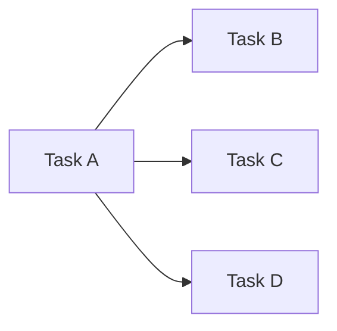
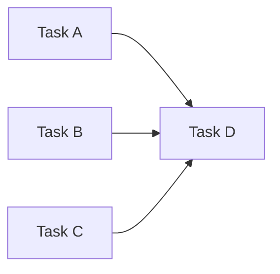
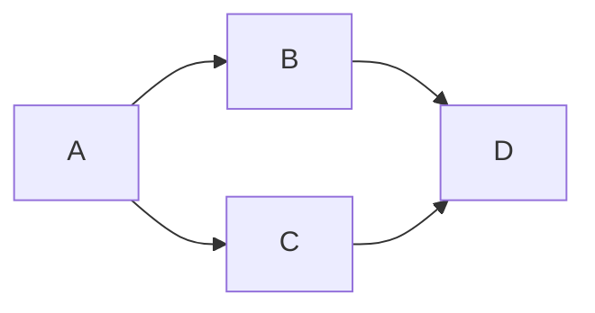

# Managing Task Dependencies

Use clipm's blocking mechanism to enforce execution order.

## Core Commands

```bash
clipm block <blocker-id> <blocked-id>    # blocked waits for blocker
clipm unblock <blocker-id> <blocked-id>  # Remove dependency
clipm show <id>                       # Check blockedBy array
```

## Verification Checkpoint

After setting up dependencies, ALWAYS verify:

```bash
clipm tree  # Visual check - arrows point in expected direction
clipm list --status todo --unblocked
```

**Expected:** Only root/initial tasks should have empty `blockedBy`.

**If wrong:** Use `clipm unblock` to remove incorrect dependencies, then re-add correctly.

**Common Mistake:** `clipm block A B` means "A blocks B" (A must finish first, B waits).
- Correct: `clipm block parent child` - child waits for parent
- Wrong: `clipm block child parent` - makes parent wait for child

## Common Patterns

### Sequential Chain


```bash
clipm add "Design"      # → abcd
clipm add "Implement"   # → efgh
clipm add "Test"        # → ijkl
clipm add "Deploy"      # → mnop

clipm block abcd efgh  # efgh waits for abcd
clipm block efgh ijkl  # ijkl waits for efgh
clipm block ijkl mnop  # mnop waits for ijkl
```

### Fan-out (One to Many)



B, C, D can run in parallel after A completes:

```bash
clipm block abcd efgh  # B waits for A
clipm block abcd ijkl  # C waits for A
clipm block abcd mnop  # D waits for A
```

### Fan-in (Many to One)



D waits for all of A, B, C:

```bash
clipm block abcd mnop  # D waits for A
clipm block efgh mnop  # D waits for B
clipm block ijkl mnop  # D waits for C
```

### Diamond



```bash
clipm block abcd efgh  # B waits for A
clipm block abcd ijkl  # C waits for A
clipm block efgh mnop  # D waits for B
clipm block ijkl mnop  # D waits for C
```

## Checking Status

```bash
# All blocked tasks
clipm list --blocked

# What blocks a specific task?
clipm show <id>   # Check blockedBy array

# Unblocked and ready
clipm list --status todo --unblocked
```

## Automatic Unblocking

When task marked `done`, clipm updates dependent tasks:

```bash
clipm status abcd done
clipm show efgh  # blockedBy now empty if only blocked by abcd
```

## Best Practices

1. **Set dependencies early** - Define when creating tasks
2. **Check before dispatch** - Verify `blockedBy == []`
3. **Use tree view** - `clipm tree` shows structure
4. **Document non-obvious deps** - `clipm note <id> "Blocked because..."`

Back to [INDEX.md](INDEX.md) | [SKILL.md](../SKILL.md)
