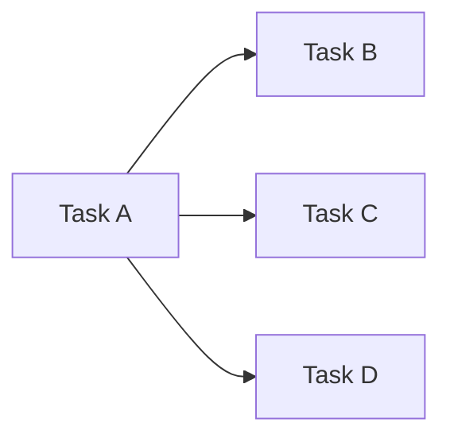
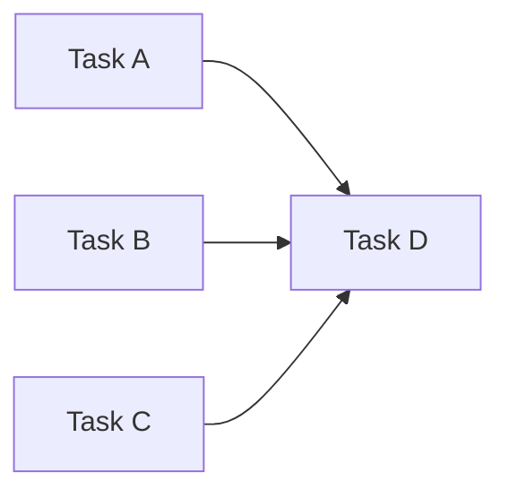
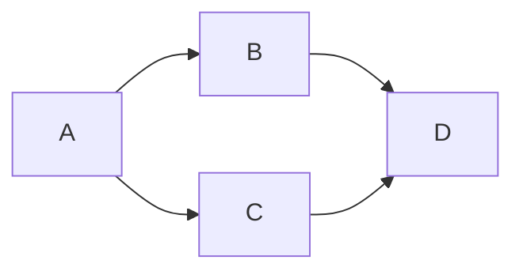

# Managing Task Dependencies

Use limbo's blocking mechanism to enforce execution order.

## Core Commands

```bash
limbo block <blocker-id> <blocked-id>    # blocked waits for blocker
limbo unblock <blocker-id> <blocked-id>  # Remove dependency
limbo show <id>                       # Check blockedBy array
```

## Verification Checkpoint

After setting up dependencies, ALWAYS verify:

```bash
limbo tree  # Visual check - arrows point in expected direction
limbo list --status todo --unblocked
```

**Expected:** Only root/initial tasks should have empty `blockedBy`.

**If wrong:** Use `limbo unblock` to remove incorrect dependencies, then re-add correctly.

**Common Mistake:** `limbo block A B` means "A blocks B" (A must finish first, B waits).
- Correct: `limbo block parent child` - child waits for parent
- Wrong: `limbo block child parent` - makes parent wait for child

## Common Patterns

### Sequential Chain


```mermaid
flowchart LR
    A[Design] --> B[Implement] --> C[Test] --> D[Deploy]
```

```bash
# All limbo add calls require --action, --verify, --result (abbreviated here)
limbo add "Design" --action "..." --verify "..." --result "..."      # → abcd
limbo add "Implement" --action "..." --verify "..." --result "..."   # → efgh
limbo add "Test" --action "..." --verify "..." --result "..."        # → ijkl
limbo add "Deploy" --action "..." --verify "..." --result "..."      # → mnop

limbo block abcd efgh  # efgh waits for abcd
limbo block efgh ijkl  # ijkl waits for efgh
limbo block ijkl mnop  # mnop waits for ijkl
```

### Fan-out (One to Many)


```mermaid
flowchart LR
    A[Task A] --> B[Task B]
    A --> C[Task C]
    A --> D[Task D]
```

B, C, D can run in parallel after A completes:

```bash
limbo block abcd efgh  # B waits for A
limbo block abcd ijkl  # C waits for A
limbo block abcd mnop  # D waits for A
```

### Fan-in (Many to One)


```mermaid
flowchart LR
    A[Task A] --> D[Task D]
    B[Task B] --> D
    C[Task C] --> D
```

D waits for all of A, B, C:

```bash
limbo block abcd mnop  # D waits for A
limbo block efgh mnop  # D waits for B
limbo block ijkl mnop  # D waits for C
```

### Diamond


```mermaid
flowchart LR
    A[A] --> B[B]
    A --> C[C]
    B --> D[D]
    C --> D
```

```bash
limbo block abcd efgh  # B waits for A
limbo block abcd ijkl  # C waits for A
limbo block efgh mnop  # D waits for B
limbo block ijkl mnop  # D waits for C
```

## Checking Status

```bash
# All blocked tasks
limbo list --blocked

# What blocks a specific task?
limbo show <id>   # Check blockedBy array

# Unblocked and ready
limbo list --status todo --unblocked
```

## Automatic Unblocking

When task marked `done`, limbo updates dependent tasks:

```bash
limbo status abcd done --outcome "Design complete: <summary>"
limbo show efgh  # blockedBy now empty if only blocked by abcd
```

## Best Practices

1. **Set dependencies early** - Define when creating tasks
2. **Check before dispatch** - Verify `blockedBy == []`
3. **Use tree view** - `limbo tree` shows structure
4. **Document non-obvious deps** - `limbo note <id> "Blocked because..."`

Back to [INDEX.md](INDEX.md) | [SKILL.md](../SKILL.md)
