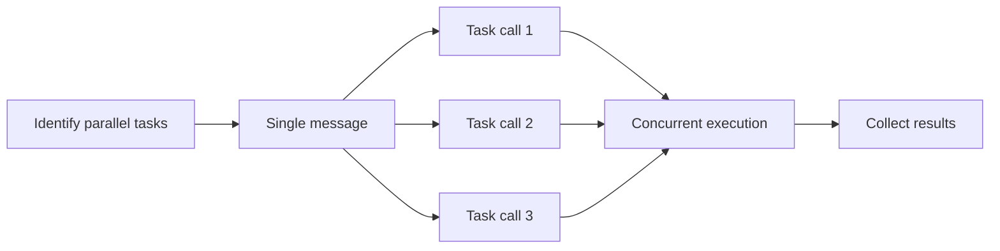

# Parallel Subagent Dispatch

Spawn multiple subagents for concurrent task execution.

## Pre-Dispatch Checklist

**Verify ALL before parallel dispatch:**

- [ ] Count leaf tasks to dispatch — verify the count matches your plan's file list
- [ ] Tasks have empty `blockedBy` arrays (`clipm show <id>`)
- [ ] Tasks don't modify same files
- [ ] Tasks don't produce output another task needs
- [ ] Total concurrent agents ≤ 5
- [ ] If dispatching in waves (>5 tasks), write down which tasks go in which wave

```bash
# Quick check for unblocked tasks
clipm list --status todo --unblocked
```

## Dispatch Method

Use Task tool with **multiple invocations in a SINGLE message**.



## Subagent Prompt Template

```
Execute clipm task <ID>: "<description>"

1. clipm claim <ID> <agent-name>
2. clipm status <ID> in-progress
3. Do: <specific work instructions>
4. Verify: <specific verification steps — build, run, test>
5. If verification fails: fix the issue and re-verify before proceeding
6. clipm note <ID> "Done: <summary>"
7. clipm status <ID> done

If blocked: clipm note <ID> "Blocked: <reason>" and report in response.
```

### ⚠️ CRITICAL: Always include verification steps

Every subagent prompt MUST include a "Verify" step. Code that compiles but crashes at runtime is not done.

**For code-writing tasks, include ALL of:**
- Build/compile check
- A runtime smoke test (run the binary, call the function, hit the endpoint)
- Fix any errors found before marking done

**Example verification steps by language:**
- **Rust**: `cargo build -p <crate> && cargo test -p <crate> && cargo run -p <crate> -- --help` (or a minimal invocation that exercises the new code path)
- **Swift**: `swift build && swift run <binary> --help` (or a minimal invocation)
- **TypeScript/JS**: `pnpm build && pnpm test && node dist/index.js --help` (or a minimal invocation)
- **Python**: `uv run python -c "from module import func; func()"` or `uv run pytest`

**"Tests pass" is not the same as "it works."** Unit tests verify isolated logic. A runtime smoke test verifies the binary starts, accepts the new flags, and doesn't crash when invoked. Always do both.

**If the task produces a binary or server**, the subagent should run it briefly and confirm it starts without crashing. "It compiles" is NOT sufficient verification.

### Template Placeholders

| Placeholder | Source | Example |
|-------------|--------|---------|
| `<ID>` | From `clipm list` output | `unke` |
| `<description>` | Task name from clipm | `Implement JWT auth` |
| `<agent-name>` | Descriptive name for this work | `jwt-impl` |
| `<specific work instructions>` | What exactly to do (see examples) | |

## Good vs Bad Prompts

### ❌ Bad: Vague instructions

```
Execute clipm task unke: "Implement auth"

1. clipm claim unke auth-agent
2. clipm status unke in-progress
3. Implement the authentication
4. clipm note unke "Done"
5. clipm status unke done
```

**Problem**: "Implement the authentication" gives no specifics.

### ✅ Good: Specific instructions

```
Execute clipm task unke: "Implement JWT token generation"

1. clipm claim unke jwt-impl
2. clipm status unke in-progress
3. Do:
   - Create src/auth/jwt.ts
   - Implement generateToken(userId) returning signed JWT
   - Implement verifyToken(token) returning decoded payload
   - Use HS256 algorithm, 24h expiry
   - Export both functions
4. clipm note unke "Done: created jwt.ts with generate/verify functions"
5. clipm status unke done

If blocked: clipm note unke "Blocked: <reason>" and report in response.
```

### ✅ Good: Research task

```
Execute clipm task ozit: "Research search libraries"

1. clipm claim ozit search-researcher
2. clipm status ozit in-progress
3. Do:
   - Compare Elasticsearch, MeiliSearch, Typesense for our Node.js app
   - Evaluate: ease of setup, query syntax, performance, hosting options
   - Recommend one with justification
   - Document findings in clipm note
4. clipm note ozit "Done: Recommend MeiliSearch - <brief reason>"
5. clipm status ozit done
```

## Agent Naming Conventions

| Task Type | Agent Name |
|-----------|------------|
| Project setup | `project-init` |
| Schema design | `schema-designer` |
| API implementation | `api-impl` |
| Test writing | `test-writer` |
| Documentation | `doc-writer` |
| Bug investigation | `bug-investigator` |
| Research | `<topic>-researcher` |

## After Dispatch

1. Wait for all subagents to complete
2. Check status: `clipm tree --show-all`
3. Fix stale tasks: if a completed subagent's task still shows `[TODO]`, run `clipm status <id> done`
4. Roll up parents: if all children of a parent are `[DONE]`, run `clipm status <parent-id> done`
5. Find newly unblocked: `clipm list --status todo --unblocked`
6. Dispatch next wave
7. Repeat until all done

## Integration Checkpoint (MANDATORY)

After completing a wave of parallel tasks, the orchestrator MUST verify integration before dispatching the next wave or marking parent tasks done.

1. **Build check:** Run full project build (`cargo build`, `swift build`, `pnpm build`, etc.)
2. **Unit test check:** Run the test suite (`cargo test`, `pnpm test`, etc.)
3. **Runtime smoke test:** Actually run the produced binary/server/function and confirm it doesn't crash. If the task added a new flag or mode, invoke it. "Tests pass" is not sufficient — exercise the real code path.
4. **Cross-component test:** If tasks produced components that interact (e.g., a server and a client), test them together
5. **Cleanup:** Stop any servers, remove sockets/temp files, kill child processes spawned during testing
6. **If failures:** Fix immediately or create fix tasks before proceeding

```bash
# Example: Rust + Swift project
cargo build 2>&1 | tail -5
swift build -c release 2>&1 | tail -5
# Run the binary briefly to catch runtime crashes
timeout 5 ./binary --help 2>&1 || echo "RUNTIME FAILURE"
```

**Do NOT mark parent task done until integration is verified.**
**Do NOT dispatch the next wave until this wave's integration passes.**
**Clean up after smoke tests.** If your smoke test spawned a server, created sockets, wrote temp files, or started processes — stop and remove them before moving on.

### Common runtime failures subagents miss

- **Pipe deadlocks**: `Process.waitUntilExit()` before reading stdout/stderr pipe (Swift/Foundation)
- **Missing framework init**: CoreGraphics/AppKit APIs crash without `NSApplication.shared` (Swift CLI tools)
- **Binary not discoverable**: Hard-coded paths that only work in one build configuration
- **Stdio corruption**: Child process writing to stdout/stderr of a TUI parent
- **Permission errors**: ScreenCaptureKit, network, file access — only surface at runtime

## Do NOT Parallelize When

- Tasks have `blockedBy` entries
- Tasks modify same files
- Task B needs output from Task A
- Tasks create files in same directory with potential naming conflicts

When uncertain, add blocking dependency:
```bash
clipm block <earlier-id> <later-id>
```

Back to [INDEX.md](INDEX.md) | [SKILL.md](../SKILL.md)
