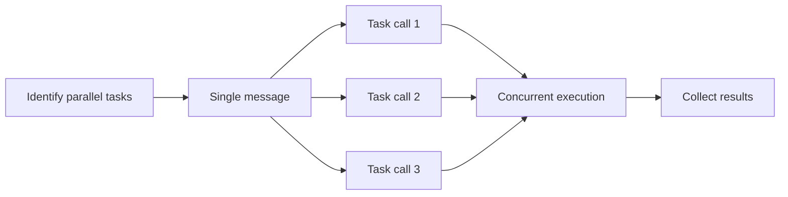

# Parallel Subagent Dispatch

Spawn multiple subagents for concurrent task execution.

## Pre-Dispatch Checklist

**Verify ALL before parallel dispatch:**

- [ ] Count leaf tasks to dispatch — verify the count matches your plan's file list
- [ ] Tasks have empty `blockedBy` arrays (`clipm show <id>`)
- [ ] Tasks don't modify same files
- [ ] Tasks don't produce output another task needs
- [ ] Total concurrent agents ≤ 5
- [ ] If dispatching in waves (>5 tasks), write down which tasks go in which wave

```bash
# Quick check for unblocked tasks
clipm list --status todo --unblocked
```

## Dispatch Method

Use Task tool with **multiple invocations in a SINGLE message**.



## Subagent Prompt Template

```
Execute clipm task <ID>: "<description>"

## Setup
clipm claim <ID> <agent-name>
clipm status <ID> in-progress

## Task
<specific work instructions>

## Verification
<specific verification steps — build, run, test>
If verification fails: fix the issue and re-verify before proceeding.

## Finish
clipm note <ID> "Done: <summary>"
clipm status <ID> done
```

**The `## Finish` block must always be the last section.** Subagents tend to skip `clipm status done` when it's buried mid-list. Putting it under a named heading after all work is complete makes it harder to miss.

### ⚠️ CRITICAL: Scope-bound subagent prompts

Subagent prompts MUST explicitly list the files the subagent is allowed to modify. Subagents that go beyond their assigned files can create conflicts with other parallel agents.

**Always include this in the Task section:**
```
IMPORTANT: Only modify these files:
- path/to/file1.rs
- path/to/file2.rs
Do NOT edit any other files, even if you notice issues in them.
```

This prevents scope creep where a subagent "helpfully" fixes something in a file another agent is also editing.

### ⚠️ CRITICAL: Always include verification steps

Every subagent prompt MUST include a "Verification" section. Code that compiles but crashes at runtime is not done.

**For code-writing tasks, include ALL of:**
- Build/compile check
- A runtime smoke test (run the binary, call the function, hit the endpoint)
- Fix any errors found before marking done

### ⚠️ CRITICAL: Preserve existing behavior when rewriting code

When a subagent replaces or rewrites an existing function/block (not just adding new code), the orchestrator MUST explicitly list **behaviors to preserve** in the prompt. Subagents cannot infer what the old code did — they only see what you tell them.

**Before writing a "replace this block" prompt, check the old code for:**
- **Timing/metrics**: Does it track `Instant::now()`, elapsed_ms, or duration? → "Preserve elapsed_ms tracking with `Instant::now()` and include it in the result via `.with_data()`"
- **Logging/tracing**: Does it emit `debug!()`, `info!()`, or structured log fields? → List each one
- **Error message format**: Does the error include context like elapsed time, selector, or element type? → Specify exact format
- **Return data shape**: Does `Ok` include `.with_data()`, `.with_screenshot()`, or other metadata? → List each attachment
- **Side effects**: Does it update shared state, emit events, or write to a log?

**If you provide replacement code in the prompt, diff it mentally against the original.** Any line in the old code that isn't in the new code is a potential regression.

### ⚠️ CRITICAL: Include edge-case analysis in subagent prompts

When writing the "Task" section of a subagent prompt, the **orchestrator** must think through edge cases and include them as explicit requirements. Subagents only know what you tell them.

**Common edge cases the orchestrator should catch:**
- **Data with special characters**: Spaces, quotes, unicode in user-facing strings
- **Empty/missing inputs**: What happens with no args, empty strings, null values
- **Boundary interactions**: Does output from this code become input elsewhere? Does the format match?
- **Quoting/escaping**: If the task involves composing strings that will be parsed later, specify quoting rules

**Example — BAD**: "Rewrite accept_completion to use space-based insertion instead of paren-based"
**Example — GOOD**: "Rewrite accept_completion to use space-based insertion. When inserting text that contains spaces, wrap it in double quotes so the parser treats it as a single token (e.g., `tap "Sign In"` not `tap Sign In`)."

The orchestrator has full context. The subagent doesn't. **Spell out the edge cases you can foresee** — don't assume the subagent will infer them from general instructions.

**Example verification steps by language:**
- **Rust**: `cargo build -p <crate> && cargo test -p <crate> && cargo run -p <crate> -- --help` (or a minimal invocation that exercises the new code path)
- **Swift**: `swift build && swift run <binary> --help` (or a minimal invocation)
- **TypeScript/JS**: `pnpm build && pnpm test && node dist/index.js --help` (or a minimal invocation)
- **Python**: `uv run python -c "from module import func; func()"` or `uv run pytest`

**"Tests pass" is not the same as "it works."** Unit tests verify isolated logic. A runtime smoke test verifies the binary starts, accepts the new flags, and doesn't crash when invoked. Always do both.

**If the task produces a binary or server**, the subagent should run it briefly and confirm it starts without crashing. "It compiles" is NOT sufficient verification.

### Template Placeholders

| Placeholder | Source | Example |
|-------------|--------|---------|
| `<ID>` | From `clipm list` output | `unke` |
| `<description>` | Task name from clipm | `Implement JWT auth` |
| `<agent-name>` | Descriptive name for this work | `jwt-impl` |
| `<specific work instructions>` | What exactly to do (see examples) | |

## Good vs Bad Prompts

### ❌ Bad: Vague instructions

```
Execute clipm task unke: "Implement auth"

1. clipm claim unke auth-agent
2. clipm status unke in-progress
3. Implement the authentication
4. clipm note unke "Done"
5. clipm status unke done
```

**Problem**: "Implement the authentication" gives no specifics.

### ✅ Good: Specific instructions with edge cases

```
Execute clipm task unke: "Implement JWT token generation"

## Setup
clipm claim unke jwt-impl
clipm status unke in-progress

## Task
- Create src/auth/jwt.ts
- Implement generateToken(userId) returning signed JWT
- Implement verifyToken(token) returning decoded payload
- Use HS256 algorithm, 24h expiry
- Export both functions
- Edge case: verifyToken must handle expired tokens gracefully (return null, not throw)
- Edge case: generateToken must reject empty/undefined userId

## Verification
pnpm build && pnpm test

## Finish
clipm note unke "Done: created jwt.ts with generate/verify functions"
clipm status unke done
```

### ✅ Good: Research task

```
Execute clipm task ozit: "Research search libraries"

## Setup
clipm claim ozit search-researcher
clipm status ozit in-progress

## Task
- Compare Elasticsearch, MeiliSearch, Typesense for our Node.js app
- Evaluate: ease of setup, query syntax, performance, hosting options
- Recommend one with justification
- Document findings in clipm note

## Finish
clipm note ozit "Done: Recommend MeiliSearch - <brief reason>"
clipm status ozit done
```

## Agent Naming Conventions

| Task Type | Agent Name |
|-----------|------------|
| Project setup | `project-init` |
| Schema design | `schema-designer` |
| API implementation | `api-impl` |
| Test writing | `test-writer` |
| Documentation | `doc-writer` |
| Bug investigation | `bug-investigator` |
| Research | `<topic>-researcher` |

## After Dispatch

1. Wait for all subagents to complete
2. Check status: `clipm tree --show-all`
3. Fix stale tasks: if a completed subagent's task still shows `[TODO]`, run `clipm status <id> done`
4. Roll up parents: if all children of a parent are `[DONE]`, run `clipm status <parent-id> done`
5. Find newly unblocked: `clipm list --status todo --unblocked`
6. Dispatch next wave
7. Repeat until all done

## Integration Checkpoint (MANDATORY)

After completing a wave of parallel tasks, the orchestrator MUST verify integration before dispatching the next wave or marking parent tasks done.

1. **Build check:** Run full project build (`cargo build`, `swift build`, `pnpm build`, etc.)
2. **Unit test check:** Run the test suite (`cargo test`, `pnpm test`, etc.)
3. **Runtime smoke test:** Actually run the produced binary/server/function and confirm it doesn't crash. If the task added a new flag or mode, invoke it. "Tests pass" is not sufficient — exercise the real code path.
4. **Output/behavior regression check:** If the change refactors existing behavior, verify the output format is preserved. Check: Are metadata fields still populated? Are status messages still emitted? Does the output schema match what downstream consumers (CLI formatters, log parsers, scripts) expect? Compare the old code path's output contract against the new one.
5. **Cross-component test:** If tasks produced components that interact (e.g., a server and a client), test them together
6. **Cleanup:** Stop any servers, remove sockets/temp files, kill child processes spawned during testing
7. **If failures:** Fix immediately or create fix tasks before proceeding

```bash
# Example: Rust + Swift project
cargo build 2>&1 | tail -5
swift build -c release 2>&1 | tail -5
# Run the binary briefly to catch runtime crashes
timeout 5 ./binary --help 2>&1 || echo "RUNTIME FAILURE"
```

**Do NOT mark parent task done until integration is verified.**
**Do NOT dispatch the next wave until this wave's integration passes.**
**Clean up after smoke tests.** If your smoke test spawned a server, created sockets, wrote temp files, or started processes — stop and remove them before moving on.

### Common runtime failures subagents miss

- **Pipe deadlocks**: `Process.waitUntilExit()` before reading stdout/stderr pipe (Swift/Foundation)
- **Missing framework init**: CoreGraphics/AppKit APIs crash without `NSApplication.shared` (Swift CLI tools)
- **Binary not discoverable**: Hard-coded paths that only work in one build configuration
- **Stdio corruption**: Child process writing to stdout/stderr of a TUI parent
- **Permission errors**: ScreenCaptureKit, network, file access — only surface at runtime

## Do NOT Parallelize When

- Tasks have `blockedBy` entries
- Tasks modify same files
- Task B needs output from Task A
- Tasks create files in same directory with potential naming conflicts

When uncertain, add blocking dependency:
```bash
clipm block <earlier-id> <later-id>
```

Back to [INDEX.md](INDEX.md) | [SKILL.md](../SKILL.md)
