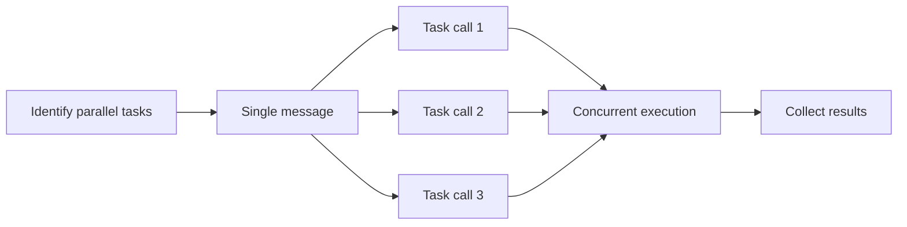

# Parallel Subagent Dispatch

Spawn multiple subagents for concurrent task execution.

## Pre-Dispatch Checklist

**Verify ALL before parallel dispatch:**

- [ ] Tasks have empty `blockedBy` arrays (`clipm show <id>`)
- [ ] Tasks don't modify same files
- [ ] Tasks don't produce output another task needs
- [ ] Total concurrent agents ≤ 5

```bash
# Quick check for unblocked tasks
clipm list --status todo --unblocked
```

## Dispatch Method

Use Task tool with **multiple invocations in a SINGLE message**.



## Subagent Prompt Template

```
Execute clipm task <ID>: "<description>"

1. clipm claim <ID> <agent-name>
2. clipm status <ID> in-progress
3. Do: <specific work instructions>
4. clipm note <ID> "Done: <summary>"
5. clipm status <ID> done

If blocked: clipm note <ID> "Blocked: <reason>" and report in response.
```

### Template Placeholders

| Placeholder | Source | Example |
|-------------|--------|---------|
| `<ID>` | From `clipm list` output | `unke` |
| `<description>` | Task name from clipm | `Implement JWT auth` |
| `<agent-name>` | Descriptive name for this work | `jwt-impl` |
| `<specific work instructions>` | What exactly to do (see examples) | |

## Good vs Bad Prompts

### ❌ Bad: Vague instructions

```
Execute clipm task unke: "Implement auth"

1. clipm claim unke auth-agent
2. clipm status unke in-progress
3. Implement the authentication
4. clipm note unke "Done"
5. clipm status unke done
```

**Problem**: "Implement the authentication" gives no specifics.

### ✅ Good: Specific instructions

```
Execute clipm task unke: "Implement JWT token generation"

1. clipm claim unke jwt-impl
2. clipm status unke in-progress
3. Do:
   - Create src/auth/jwt.ts
   - Implement generateToken(userId) returning signed JWT
   - Implement verifyToken(token) returning decoded payload
   - Use HS256 algorithm, 24h expiry
   - Export both functions
4. clipm note unke "Done: created jwt.ts with generate/verify functions"
5. clipm status unke done

If blocked: clipm note unke "Blocked: <reason>" and report in response.
```

### ✅ Good: Research task

```
Execute clipm task ozit: "Research search libraries"

1. clipm claim ozit search-researcher
2. clipm status ozit in-progress
3. Do:
   - Compare Elasticsearch, MeiliSearch, Typesense for our Node.js app
   - Evaluate: ease of setup, query syntax, performance, hosting options
   - Recommend one with justification
   - Document findings in clipm note
4. clipm note ozit "Done: Recommend MeiliSearch - <brief reason>"
5. clipm status ozit done
```

## Agent Naming Conventions

| Task Type | Agent Name |
|-----------|------------|
| Project setup | `project-init` |
| Schema design | `schema-designer` |
| API implementation | `api-impl` |
| Test writing | `test-writer` |
| Documentation | `doc-writer` |
| Bug investigation | `bug-investigator` |
| Research | `<topic>-researcher` |

## After Dispatch

1. Wait for all subagents to complete
2. Check status: `clipm tree`
3. Find newly unblocked: `clipm list --status todo --unblocked`
4. Dispatch next wave
5. Repeat until all done

## Integration Checkpoint

After completing a wave of parallel tasks, verify integration:

1. **Build check:** Run project build (`cargo check`, `npm run build`, etc.)
2. **Smoke test:** Run minimal functionality test
3. **If failures:** Create fix tasks before proceeding to next wave

```bash
# Example integration checkpoint
cargo check 2>&1 | head -20  # Quick compilation check
```

**Do NOT mark parent task done until integration is verified.**

## Do NOT Parallelize When

- Tasks have `blockedBy` entries
- Tasks modify same files
- Task B needs output from Task A
- Tasks create files in same directory with potential naming conflicts

When uncertain, add blocking dependency:
```bash
clipm block <earlier-id> <later-id>
```

Back to [INDEX.md](INDEX.md) | [SKILL.md](../SKILL.md)
