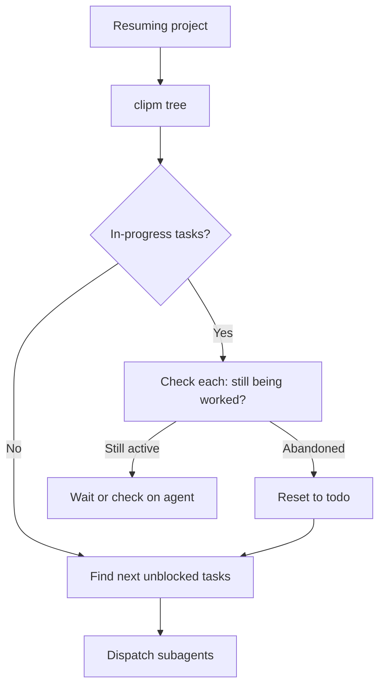

# Recovery: Resuming Interrupted Projects

How to re-enter a project mid-execution.

## Re-entry Checklist



## Step 1: Assess Current State

```bash
clipm tree              # Visual overview
clipm list              # Full task data (JSON)
```

## Step 2: Handle In-Progress Tasks

For each task with status `in-progress`:

```bash
clipm show <id>
```

**If owner is active agent**: Wait for completion or check agent status.

**If owner is stale/unknown**: Reset the task:
```bash
clipm note <id> "Reset: previous agent abandoned"
clipm unclaim <id>
clipm status <id> todo
```

**If work was partially done**: Assess and decide:
- Complete manually and mark done
- Reset and re-dispatch from scratch
- Create sub-task for remaining work

## Step 3: Find Available Work

```bash
clipm list --status todo --unblocked
```

Returns tasks that:
- Status is `todo`
- Not blocked by any incomplete task

## Step 4: Resume Dispatch

Dispatch available tasks per [parallel.md](parallel.md).

## State Summary Commands

| What | Command |
|------|---------|
| All active tasks | `clipm list` |
| All tasks (incl. done) | `clipm list --show-all` |
| Visual tree | `clipm tree` |
| Full tree (incl. done) | `clipm tree --show-all` |
| Todo only | `clipm list --status todo` |
| In-progress | `clipm list --status in-progress` |
| Completed | `clipm list --status done --show-all` |
| Next available | `clipm next` |

## Common Re-entry Scenarios

### Scenario: Session crashed mid-project

1. Run `clipm tree` to see state
2. Check each `in-progress` task - likely abandoned
3. Reset abandoned tasks to `todo`
4. Continue dispatching

### Scenario: Returning next day

1. Run `clipm list --status done --show-all` to review completed work
2. Run `clipm tree` to see remaining work
3. Identify any blocked tasks that are now unblocked
4. Dispatch next wave

### Scenario: Another agent was working

Check ownership before resetting:
```bash
clipm show <id>  # Check owner field
```

If owner is current session, safe to reset. If different session, coordinate or wait.

Back to [INDEX.md](INDEX.md) | [SKILL.md](../SKILL.md)
