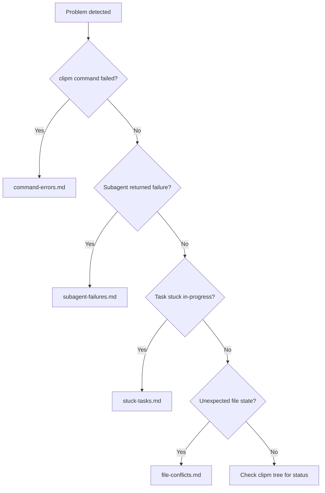

# Troubleshooting Index

| Problem | Symptoms | Link |
|---------|----------|------|
| **Command Failures** | clipm returns error | [command-errors.md](command-errors.md) |
| **Subagent Failures** | Agent reports failure or times out | [subagent-failures.md](subagent-failures.md) |
| **Stuck Tasks** | Tasks remain in-progress indefinitely | [stuck-tasks.md](stuck-tasks.md) |
| **File Conflicts** | Parallel tasks overwrote each other | [file-conflicts.md](file-conflicts.md) |

## Quick Diagnosis

Back to [SKILL.md](../SKILL.md)
