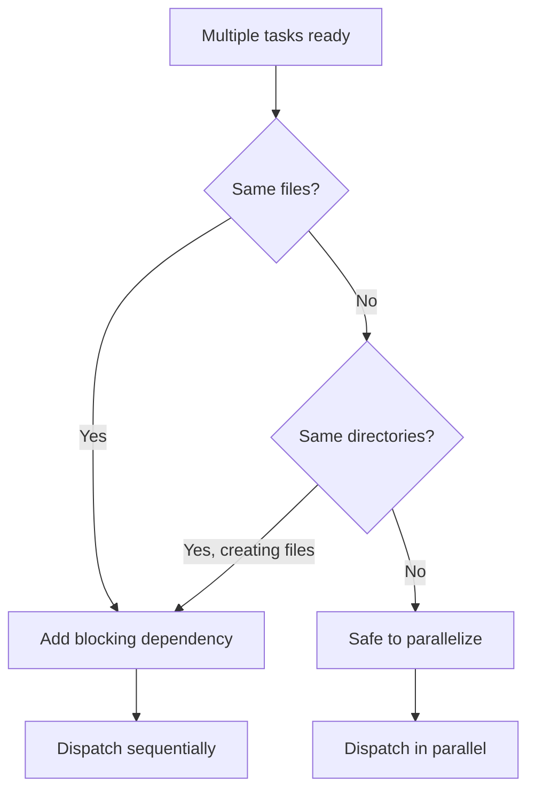

# File Conflicts

## Parallel tasks overwrote each other

**Symptom**: File contains partial changes, missing expected code, or merge-like conflicts.

**Diagnosis**:
```bash
git diff <file>        # See what changed
git log -3 --oneline   # Recent commits
```

## Recovery

### If using git:
```bash
git stash              # Save current state
git checkout <file>    # Restore to last commit
```

Then re-run tasks sequentially.

### If no git:
Manually review file and reconstruct correct state. Add clipm note documenting the conflict.

## Prevention Checklist

Before parallel dispatch, verify:

- [ ] Tasks don't share target files
- [ ] Tasks don't write to same directories
- [ ] Tasks don't depend on each other's output

**How to check**:
```bash
clipm show <id-1>  # Review task description
clipm show <id-2>  # Compare target files
```

If tasks might conflict, dispatch sequentially:
```bash
clipm block <id-1> <id-2>  # Force sequential execution
```

## File Conflict Diagram



Back to [INDEX.md](INDEX.md) | [SKILL.md](../SKILL.md)
