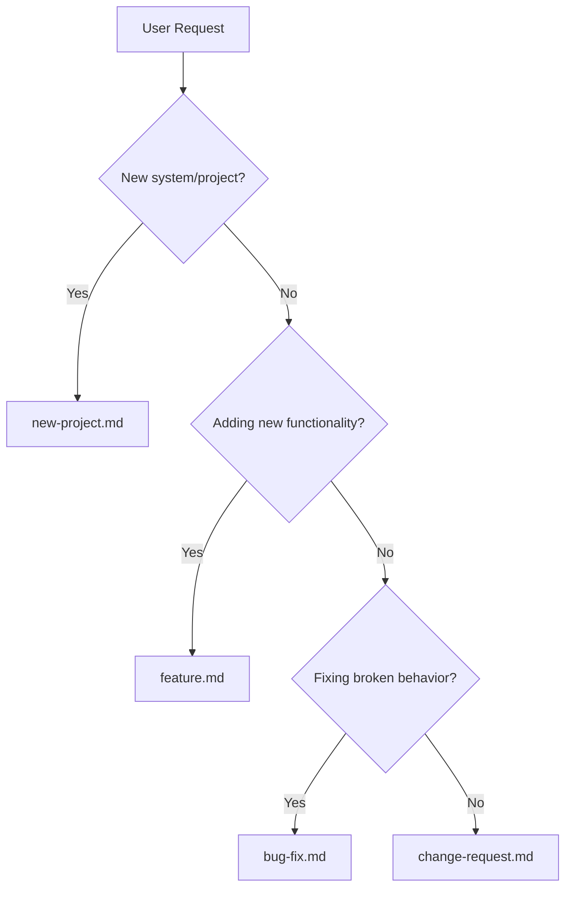

# Workflow Index

| Workflow | Use When | Link |
|----------|----------|------|
| **New Project** | Building new system or major feature set | [new-project.md](new-project.md) |
| **Feature** | Adding single feature to existing code | [feature.md](feature.md) |
| **Bug Fix** | Investigating and fixing a bug | [bug-fix.md](bug-fix.md) |
| **Change Request** | Modifying existing functionality | [change-request.md](change-request.md) |

Back to [SKILL.md](../SKILL.md)
